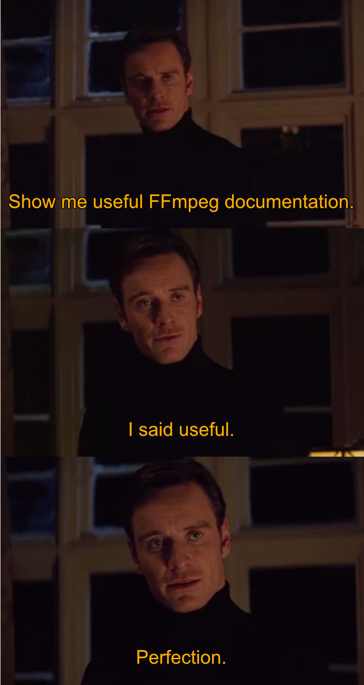

---

# FFmpeg

- [FFmpeg official page](https://ffmpeg.org/)
- [install via Homebrew](https://formulae.brew.sh/formula/ffmpeg)

```
ffmpeg -i input.mov output.mp4
```

---

# Documentation

- [FFmpeg documentation](https://ffmpeg.org/documentation.html)
- [FFmpeg wiki](https://trac.ffmpeg.org/wiki)
- [Warp AI](https://www.warp.dev/warp-ai)



---

# Format conversion

```
ffmpeg -i input.mov output.mp4
```

---

# Format conversion

## Specify codec

```
ffmpeg -i input.mp4 -c:v libx264 output.mp4
```

- Codec H.264 is currently the best choice for displaying in the browser.

---

# Format conversion

## Optimal settings

```
ffmpeg -i input.mp4 -c:v libx264 -c:a copy -preset medium -crf 23 output.mp4
```

- Good mix of quality and speed of conversion.

---

# Mono sound

```
ffmpeg -i input.mov -ac 1 output.mp4
```

- Stereo sound is usually not needed.

---

# Crop

```
ffmpeg -i input.mov -ss 00:00:05 -to 00:00:10 output.mp4
```

- Remove unnecessary parts of video.
- E.g. stumbling to find the icon to stop recording.

---

# Scale to fit width 1000px

```
ffmpeg -i input.mov -vf "setsar=1,scale='min(1000,iw)':-2" output.mp4
```

- `setsar` - Set sample aspect ratio.
- height `-2` - Makes sure height is divisible by 2, which is required by some codecs.

```
videofit() {
  local source=$1
  local max_width=${2:-1000}
  local output="${source%.*}.${max_width}.mp4"
  ffmpeg -i "$source" -vf "setsar=1,scale='min($max_width,iw)':-2" "$output"
}
```

---

# Video from image

```
ffmpeg -loop 1 -i input.png -c:v libx264 -t 3 output.mp4
```

---

# Join videos

## input.txt

```
file input1.mp4
file input2.mp4
```

## CLI

```
ffmpeg -f concat -i input.txt -c copy output.mp4
```

---

# Join videos function

```
videoconcat() {
  # Create input.txt file
  local input_file="input.txt"
  touch "$input_file"

  # Loop through the parameters and append file paths to input.txt
  for video_file in "$@"; do
    echo "file '$video_file'" >> "$input_file"
  done

  # Concatenate the videos
  ffmpeg -f concat -i "$input_file" -c copy output.mp4

  # Delete the input.txt file
  rm "$input_file"
}
```

---

# Video to GIF

## Naive version

```
ffmpeg -i input.mov output.gif
```

---

# Video to GIF

## With limited FPS

```
ffmpeg -i input.mov -vf "fps=10,scale=1000:-1:flags=lanczos" output.gif
```

- When using filters, scale has to be set.
- The ["lanczos" resampling algorithm](https://en.wikipedia.org/wiki/Lanczos_resampling) seems to produce the sharpest GIFs.

---

# Video to GIF

## With palette

```
ffmpeg -y -i input.mov -vf fps=10,scale=1000:-1:flags=lanczos,palettegen palette.png
ffmpeg -y -i input.mov -i palette.png -filter_complex "fps=10,scale=1000:-1:flags=lanczos[x];[x][1:v]paletteuse" output.gif
```

---

# Video to GIF

# All together now

```
# First parameter is video file path. Second parameter is GIF width
videotogif () {
  local palette=_palette.png
  local source=$1
  local scale=$2
  local output="${source%.*}.gif"

  # If scale is not provided, get the video's width
  if [ -z "$scale" ]; then
    scale=$(ffprobe -v error -select_streams v:0 -show_entries stream=width -of default=noprint_wrappers=1:nokey=1 "$source")
  fi

  # create palette
  ffmpeg -y -i "$source" -vf "fps=10,scale=$scale:-1:flags=lanczos,palettegen" "$palette"

  # generate gif
  ffmpeg -y -i "$source" -i "$palette" -filter_complex "fps=10,scale=$scale:-1:flags=lanczos[x];[x][1:v]paletteuse" "$output"

  # cleanup palette
  rm "$palette"
}
```

---

# Dual recording

- Use OBS to record screen and cam at once.
- Crop parts of the recording into separate videos.

```
ffmpeg -i input.mov -filter:v "crop=1920:1080:0:0" screen.mp4
ffmpeg -i input.mov -filter:v "crop=1920:1080:1920:0" cam.mp4
```
